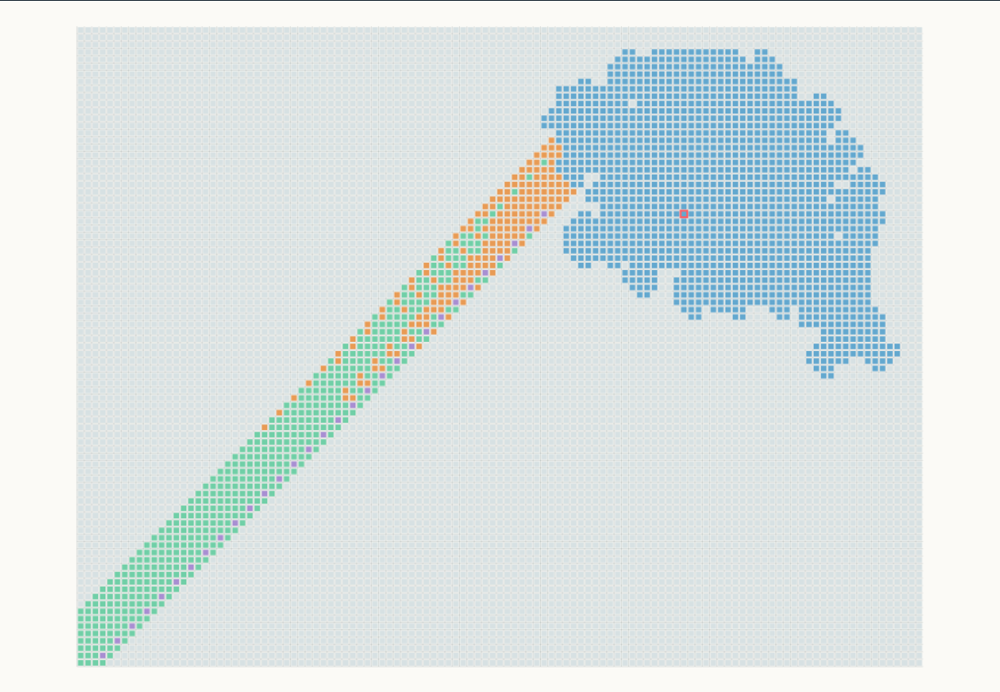

# Langton's Ant: proof and research core

## One-black theorem

This repository contains a complete Lean-checked proof that every classical
Langton-ant state with exactly one black cell, at any ant position and heading,
eventually reaches the standard translating period-104 highway:

```lean
theorem OneBlack.universal_one_black :
    ∀ s, ExactlyOneBlack s → ReachesP104 s
```

[](https://kehao95.github.io/langtons-ant-core/)

*Global proof map: every visible black-cell placement is assigned to one of
the five proof stages. The colored rays represent affine classes that the Lean
proof extends to every depth. Click the image for the interactive guide.*

- [Read the published preprint](https://doi.org/10.5281/zenodo.22086968)
- [Read the proof](./one_black/PROOF.md)
- [Inspect and rebuild the proof artifact](./one_black/README.md)
- [Explore the interactive proof guide](https://kehao95.github.io/langtons-ant-core/)
- [Download X-ready proof animations](./media/x/README.md)

> Hao Ke, *Every One-Black-Cell Langton Ant Reaches the Period-104 Highway:
> A Lean-Checked Proof*, Zenodo, 2026.
> [doi:10.5281/zenodo.22086968](https://doi.org/10.5281/zenodo.22086968)

The browser guide is explanatory. The theorem in
[`one_black/lean/OneBlack.lean`](./one_black/lean/OneBlack.lean) and its closed
Lean proof cone are authoritative. This result does not prove the general
finite-support Highway Conjecture.
